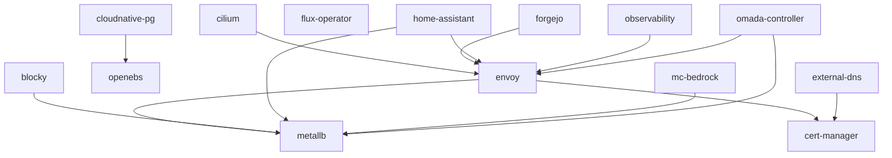

# Tale Homelab (Talos Mini-cluster)

This repository contains all of the necessary configuration files for my own
homelab mini-cluster built on top of [Talos Linux](https://www.talos.dev/). For
the hardware specifics see the [Hardware](#hardware) section below. With the
actual cluster software, I was aiming to have a very simple setup that is
secure by default, easy to manage, and optionally immutable. Talos Linux
checked all of those boxes and includes tons of extra goodies for homelabbers.

## Deployments

All deployments are managed by [Flux CD](https://fluxcd.io/) using a GitOps
workflow. The [Flux Operator](https://fluxoperator.dev) handles Flux lifecycle
management (install, upgrade, configuration) declaratively via a `FluxInstance`
CRD. Pushing changes to the `k8s/` directory automatically reconciles
the cluster state. SOPS-encrypted secrets are decrypted natively by Flux using
[age](https://github.com/FiloSottile/age) encryption.

- Infrastructure (`k8s/infra/`)
  - [**Flux Operator**](./k8s/infra/flux-operator/): Flux lifecycle management and web UI
  - [**OpenEBS**](./k8s/infra/openebs/): Replicated storage
  - [**MetalLB**](./k8s/infra/metallb/): Load balancer
  - [**cert-manager**](./k8s/infra/cert-manager/): TLS certificate issuer
  - [**Envoy Gateway**](./k8s/infra/envoy/): Gateway
  - [**External DNS**](./k8s/infra/external-dns/): Automatic Cloudflare DNS
  - [**Cilium**](./k8s/infra/cilium/): CNI and Hubble UI
  - [**CloudNativePG**](./k8s/infra/cloudnative-pg/): Centralized PostgreSQL

- Apps (`k8s/`)
  - [**Blocky**](./k8s/blocky/): DNS server for ad-blocking
  - [**Forgejo**](./k8s/forgejo/): Self-hosted Git server
  - [**Observability**](./k8s/observability/): Prometheus, VictoriaMetrics, Grafana
  - [**Omada Controller**](./k8s/omada-controller/): TP-Link network management
  - [**Home Assistant**](./k8s/home-assistant/): Home automation
  - [**MC Bedrock**](./k8s/mc-bedrock/): Minecraft Bedrock server

## Dependency Graph

<!-- regenerate with: bash k8s/generate-diagram.sh -->


## Bootstrap

The cluster is bootstrapped from scratch in three steps. The Flux Operator
replaces the old `flux bootstrap` CLI workflow with a declarative
`FluxInstance` CRD that manages Flux controller installation, upgrades,
and Git synchronization.

```bash
# 1. Install the Flux Operator via Helm (one-time)
helm install flux-operator \
  oci://ghcr.io/controlplaneio-fluxcd/charts/flux-operator \
  --namespace flux-system \
  --create-namespace

# 2. Create the SOPS age secret (so Flux can decrypt encrypted manifests)
kubectl create secret generic sops-age \
  --namespace=flux-system \
  --from-file=age.agekey=$HOME/.config/sops/age/keys.txt

# 3. Apply the FluxInstance (starts Flux controllers and syncs this repo)
kubectl apply -f k8s/infra/flux-operator/instance.yaml
```

After step 3, the operator installs the Flux controllers, creates a
`GitRepository` pointing at this repo, and begins reconciling `k8s/`.
Everything else is automatic — the `dependsOn` chain in each project's
`flux.yaml` ensures correct ordering:

1. **No deps:** flux-operator, openebs, metallb, cert-manager
2. **After openebs:** cloudnative-pg
3. **After metallb + cert-manager:** envoy
4. **After cert-manager:** external-dns
5. **After envoy:** cilium, forgejo, observability
6. **After metallb:** blocky, mc-bedrock
7. **After envoy + metallb:** home-assistant, omada-controller

Once reconciled, the `flux-operator` HelmRelease takes over management of
the operator itself — future upgrades happen via Git, not Helm CLI.

The Flux Operator web UI is available at `https://flux.tale.me` (protected
by OIDC via Envoy Gateway and Pocket ID).

### Migrating from `flux bootstrap`

If the cluster is already running Flux via the old `flux bootstrap` workflow,
the operator can take over in-place without tearing anything down:

```bash
# 1. Install the operator alongside the running Flux controllers
helm install flux-operator \
  oci://ghcr.io/controlplaneio-fluxcd/charts/flux-operator \
  --namespace flux-system

# 2. Apply the FluxInstance — operator takes over Flux management
kubectl apply -f k8s/infra/flux-operator/instance.yaml

# 3. Wait for the operator to confirm it owns Flux
kubectl -n flux-system wait fluxinstance/flux \
  --for=condition=Ready --timeout=5m

# 4. Commit and push (the repo no longer contains k8s/flux-system/)
#    Pruning the old bootstrap manifests is safe because the operator
#    now manages the controllers independently.
```

### Adding a new deployment

1. Create a directory under `k8s/<name>/`
2. Add a `kustomization.yaml` listing its resources
3. Add a `flux.yaml` with a Flux Kustomization CRD (set `dependsOn` as needed)
4. Add `<name>/flux.yaml` to `k8s/kustomization.yaml`
5. Push to git

### Tools

All tools are installed using [Mise](https://mise.jdx.dev/):

- [**helm**](https://helm.sh/): Helm chart management (bootstrap only)
- [**talosctl**](https://www.talos.dev/v1.10/reference/cli/): Talos control
- [**sops**](https://github.com/getsops/sops): Secrets management
- [**age**](https://github.com/FiloSottile/age): File encryption

### Hardware

My goals for a homelab are to have a small, quiet, and power-efficient cluster
that is still capable of running a variety of workloads. I just created this
cluster, but eventually it'll be all rackmounted and fancy. The hardware I chose
is as follows:

- **3x Dell OptiPlex Micro 7050**
  - Intel Core i7-7700T
  - 32GB DDR4 RAM @ 2400MHz
  - 240GB SATA SSD (for Talos)
  - 2TB NVMe SSD (replicated storage)
  - 1x 1GbE built-in NIC (LAN and WAN access)
  - 1x 2.5GbE M.2 A-Key NIC (intra-cluster communication)
- **1x UGREEN 2.5GbE Switch**
  - 5x 2.5GbE RJ45 ports
  - 1x 10GbE SFP+ port
- **Planned but not yet purchased:**
  - 1x Generic UPS with `usbhid-ups` support
  - 1x Raspberry Pi 4B
    - Runs a NUT server to monitor the UPS and signal the cluster
    - Runs a tunnelable Tailscale node for LAN recovery access
    - Possibly PiKVM for remote KVM access (if needed)
