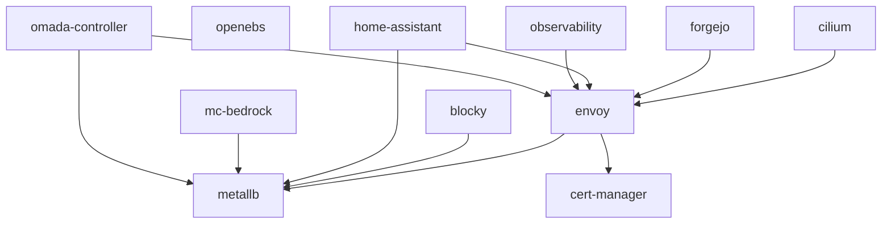

# Tale Homelab (Talos Mini-cluster)

This repository contains all of the necessary configuration files for my own
homelab mini-cluster built on top of [Talos Linux](https://www.talos.dev/). For
the hardware specifics see the [Hardware](#hardware) section below. With the
actual cluster software, I was aiming to have a very simple setup that is
secure by default, easy to manage, and optionally immutable. Talos Linux
checked all of those boxes and includes tons of extra goodies for homelabbers.

## Deployments

All deployments are managed by [Flux CD](https://fluxcd.io/) using a GitOps
workflow. Pushing changes to the `k8s/` directory automatically reconciles
the cluster state. SOPS-encrypted secrets are decrypted natively by Flux using
[age](https://github.com/FiloSottile/age) encryption.

- Infrastructure (`k8s/infra/`)
  - [**OpenEBS**](./k8s/infra/openebs/): Replicated storage
  - [**MetalLB**](./k8s/infra/metallb/): Load balancer
  - [**cert-manager**](./k8s/infra/cert-manager/): TLS certificate issuer
  - [**Envoy Gateway**](./k8s/infra/envoy/): Gateway
  - [**Cilium**](./k8s/infra/cilium/): CNI and Hubble UI

- Apps (`k8s/`)
  - [**Blocky**](./k8s/blocky/): DNS server for ad-blocking
  - [**Forgejo**](./k8s/forgejo/): Self-hosted Git server
  - [**Observability**](./k8s/observability/): Prometheus, VictoriaMetrics, Grafana
  - [**Omada Controller**](./k8s/omada-controller/): TP-Link network management
  - [**Home Assistant**](./k8s/home-assistant/): Home automation
  - [**MC Bedrock**](./k8s/mc-bedrock/): Minecraft Bedrock server

## Dependency Graph

<!-- regenerate with: bash k8s/generate-diagram.sh -->


## Bootstrap

Flux needs to be bootstrapped once per cluster. This sets up the Flux
controllers and connects them to this repository.

```bash
# 1. Create the SOPS age secret (so Flux can decrypt encrypted manifests)
kubectl create namespace flux-system
kubectl create secret generic sops-age \
  --namespace=flux-system \
  --from-file=age.agekey=$HOME/.config/sops/age/keys.txt

# 2. Bootstrap Flux (requires a GitHub PAT with `repo` scope)
export GITHUB_TOKEN=<your-github-pat>
flux bootstrap github \
  --owner=tale \
  --repository=homelab \
  --path=k8s \
  --personal
```

After bootstrapping, Flux watches this repository and automatically applies
changes pushed to `k8s/apps/`. The `k8s/flux-system/` directory is
auto-generated by the bootstrap process and should not be manually edited.

### Adding a new deployment

1. Create a directory under `k8s/apps/<name>/`
2. Add a `kustomization.yaml` listing its resources
3. Add `<name>` to `k8s/apps/kustomization.yaml`
4. Push to git

### Tools

All tools are installed using [Mise](https://mise.jdx.dev/):

- [**flux**](https://fluxcd.io/): GitOps controller
- [**talosctl**](https://www.talos.dev/v1.10/reference/cli/): Talos control
- [**sops**](https://github.com/getsops/sops): Secrets management
- [**age**](https://github.com/FiloSottile/age): File encryption

### Hardware

My goals for a homelab are to have a small, quiet, and power-efficient cluster
that is still capable of running a variety of workloads. I just created this
cluster, but eventually it'll be all rackmounted and fancy. The hardware I chose
is as follows:

- **3x Dell OptiPlex Micro 7050**
  - Intel Core i7-7700T
  - 32GB DDR4 RAM @ 2400MHz
  - 240GB SATA SSD (for Talos)
  - 2TB NVMe SSD (replicated storage)
  - 1x 1GbE built-in NIC (LAN and WAN access)
  - 1x 2.5GbE M.2 A-Key NIC (intra-cluster communication)
- **1x UGREEN 2.5GbE Switch**
  - 5x 2.5GbE RJ45 ports
  - 1x 10GbE SFP+ port
- **Planned but not yet purchased:**
  - 1x Generic UPS with `usbhid-ups` support
  - 1x Raspberry Pi 4B
    - Runs a NUT server to monitor the UPS and signal the cluster
    - Runs a tunnelable Tailscale node for LAN recovery access
    - Possibly PiKVM for remote KVM access (if needed)
