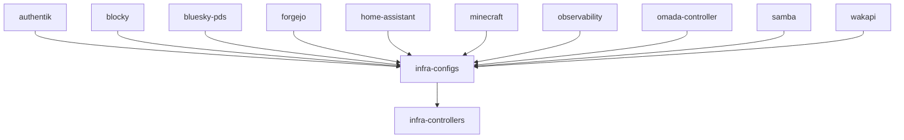

# Tale Homelab

Configuration for my homelab mini-cluster running on
[Talos Linux](https://www.talos.dev/) along with a variety of applications that
run in the Oracle Cloud. All Kubernetes deployments are managed with
[Flux](https://fluxcd.io/), using SOPS for secrets and Kustomize for templating.

## What's Running

**Infrastructure** (`k8s/infra/`)
- [Cilium](https://cilium.io/) — Cluster Networking
- [OpenEBS](https://openebs.io/) — Replicated NVMe storage
- [MetalLB](https://metallb.universe.tf/) — Bare-metal load balancer
- [Envoy Gateway](https://gateway.envoyproxy.io/) — Gateway API
- [cert-manager](https://cert-manager.io/) — TLS certificates
- [CloudNativePG](https://cloudnative-pg.io/) — Centralized PostgreSQL cluster
- [Flux Operator](https://fluxoperator.dev/) — Flux lifecycle management
- [Tailscale](https://tailscale.com/) — Operator with an HA `ProxyGroup` for tailnet ingress, plus metrics ([k8s/infra/configs/tailscale/](./k8s/infra/configs/tailscale/))

**Apps** (`k8s/`)
- [Authentik](./k8s/authentik/) — Identity provider / SSO (OIDC) for cluster apps
- [Blocky](./k8s/blocky/) — DNS proxy and ad-blocker
- [Bluesky PDS](./k8s/bluesky-pds/) — Personal Data Server for atproto
- [Forgejo](./k8s/forgejo/) — Git server with GitHub mirroring via Gickup
- [Home Assistant](./k8s/home-assistant/) — Home automation, with Eufy WS and Scrypted
- [Minecraft](./k8s/minecraft/) — Vanilla survival server, exposed over Tailscale
- [Observability](./k8s/observability/) — VictoriaMetrics, Grafana, alerting
- [Omada Controller](./k8s/omada-controller/) — TP-Link network management
- [Samba](./k8s/samba/) — Network file shares
- [Wakapi](./k8s/wakapi/) — Self-hosted WakaTime-compatible coding stats

## Dependency Graph



## Bootstrap

```bash
# 1. Install the Flux Operator (one-time)
helm install flux-operator \
  oci://ghcr.io/controlplaneio-fluxcd/charts/flux-operator \
  --namespace flux-system --create-namespace

# 2. Create the SOPS age secret
kubectl create secret generic sops-age \
  --namespace=flux-system \
  --from-file=age.agekey=$HOME/.config/sops/age/keys.txt

# 3. Apply the FluxInstance — everything else is automatic
kubectl apply -f k8s/infra/flux-operator/instance.yaml
```

The `dependsOn` chain handles ordering: controllers → configs → apps.

## Adding a New App

1. Create `k8s/<name>/` with `kustomization.yaml`, `flux.yaml`, and `manifests/`
2. Add `<name>/flux.yaml` to `k8s/kustomization.yaml`
3. Push

## Hardware

- **3x Dell OptiPlex Micro 7050**
  - Intel Core i7-7700T, 32GB DDR4
  - 240GB SATA SSD (Talos OS), 2TB NVMe SSD (replicated storage)
  - 1GbE built-in NIC + 2.5GbE M.2 NIC (intra-cluster)
- **UGREEN 2.5GbE Switch** (5x 2.5GbE + 1x 10GbE SFP+)
- **TP-Link Omada ER605 Router** (WAN + 1GbE management)
- **TP-Link Omada SG2008 Switch** (8x 1GbE for management and IoT)
- **2x TP-Link Omada EAP773 Access Point** (Wi-Fi 7 AP)
